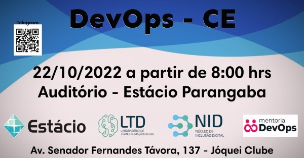
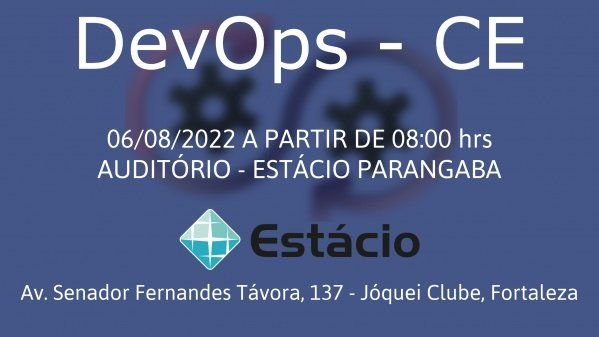

# Meetups Devops CE
Somos uma comunidade e mensalmente organizamos eventos com palestras sobre a cultura DevOps e suas tecnologias. O intuito desses encontros é o compartilhamento de conhecimento, fomentar a cultura DevOps no estado e fazer networking.

Grupo Telegram: [https://t.me/devopsce](https://t.me/devopsce)

> Os eventos são gratuitos, não temos nenhum tipo de ajuda financeira de qualquer organização.

## 22/10/2022

[Link do evento Sympla](https://www.sympla.com.br/evento/meetup-devops-ceara/1720105?lang=PT)

**Descrição:** Segundo meetup do ano da comunidade DevOps - CE acontecerá no dia 22/10/2022 na Estácio Parangaba.

Neste meetup, serão apresentadas palestras sobre a cultura DevOps, suas ferramentas e suas principais terminologias.

DevOps não é uma ferramenta ou uma equipe, é o processo ou uma metodologia de uso de várias ferramentas para resolver os problemas entre os desenvolvedores e a equipe de operações, daí o termo “DevOps”.

Neste meetup, serão apresentadas palestras sobre a cultura DevOps, suas ferramentas e suas principais terminologias.

**Palestras apresentadas:**

- Ingrid Santos - Saúde mental, estresse e esgotamento
    - https://www.linkedin.com/in/ingrid-dos-santos/
- Lindemberg Barbosa - Orquestração de containers com Docker Swarm
    - https://www.linkedin.com/in/lindemberg-barbosa/
- João Lobo - Istio & Service Mesh
    - https://www.linkedin.com/in/joaolgn/
- Edson Ferreira - Policy as code
    - https://www.linkedin.com/in/edsoncelio/

**Local:**
Centro Universitário Estácio - Campus Parangaba
Avenida Senador Fernandes Távora, 137, Próximo ao North Shopping Jóquei, Jóquei Clube - Fortaleza, CE

## 06/08/2022

[Link do evento Sympla](https://www.sympla.com.br/evento/meetup-devops-ceara/1646571)

**Descrição:** Após 2 anos de pandemia, estamos de volta \o/, próximo mês retornaremos com nosso meetup da comunidade DevOPs-CE presencial.

DevOps não é uma ferramenta ou uma equipe, é o processo ou uma metodologia de uso de várias ferramentas para resolver os problemas entre os desenvolvedores e a equipe de operações, daí o termo “DevOps”.

Neste meetup, serão apresentadas palestras sobre a cultura DevOps, suas ferramentas e suas principais terminologias.

**Palestras apresentadas:**

- Alysson Alves: Monitoramento ou Observabilidade?
- José Araújo: IaC com AWS SDK - Overview
- Ezzio Moreira: Fluxo de trabalho em equipe com Terraform
- Alesson Viana: Automação de configuração com Ansible
- Francisco Wallison: DevOps para Desenvolvedores, vivenciando todo o ciclo de entrega

**Local:**
Centro Universitário Estácio - Campus Parangaba
Avenida Senador Fernandes Távora, 137, Próximo ao North Shopping Jóquei, Jóquei Clube - Fortaleza, CE

